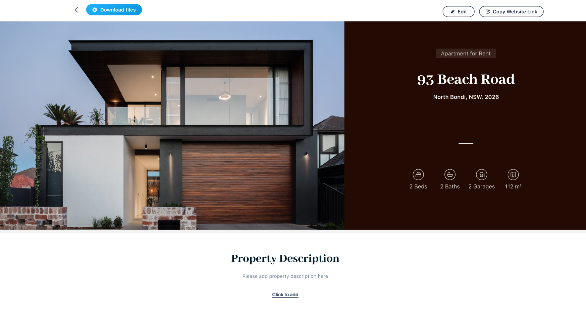

# Brady Zhang - Personal Portfolio

A modern, single-page personal website built with Next.js 15, React 19, TypeScript, and Tailwind CSS. Showcases projects, skills, and contact information, with a beautiful Vanta.js animated background.

## ✨ Features

- **Single Page Scroll**: Home, Projects, and About sections in one smooth-scrolling page.
- **Vanta.js Animation**: Interactive animated background on the Home section.
- **Responsive Design**: Fully responsive, works on all devices.
- **Project Showcase**: Large, visually appealing project cards with images, tech stack, and external links.
- **About Me & Skills**: Concise introduction and highlighted technical skills.
- **Contact Information**: Email and phone number, with direct links.
- **Resume Download**: Download or view resume PDF directly from the site.
- **Dark Theme**: Consistent dark background and white text for all sections.
- **Smooth Navigation**: Scroll arrows and mouse wheel navigation between sections.

## 🖥️ Tech Stack

- [Next.js 15](https://nextjs.org/)
- [React 19](https://react.dev/)
- [TypeScript](https://www.typescriptlang.org/)
- [Tailwind CSS 4](https://tailwindcss.com/)
- [Vanta.js (Halo effect)](https://www.vantajs.com/)
- [Three.js](https://threejs.org/)

## 📂 Project Structure

```
resume-app/
├── app/
│   ├── globals.css         # Global styles (Tailwind, scrollbar, dark mode)
│   ├── layout.tsx          # Root layout and metadata
│   └── page.tsx            # Main single-page app entry
├── components/
│   ├── Navigation.tsx      # Top navigation bar
│   ├── ScrollArrow.tsx     # Up/down scroll arrow component
│   ├── VantaBackground.tsx # Vanta.js background wrapper
│   └── sections/
│       ├── HomeSection.tsx
│       ├── ProjectSection.tsx
│       └── AboutSection.tsx
├── hooks/
│   └── useScrollWheel.ts   # Custom hook for scroll navigation
├── public/
│   ├── 1.png               # Project 1 image
│   ├── 2.png               # Project 2 image
│   ├── BRADY_ZHANG_Resume_4.pdf # Resume PDF
│   └── ...                 # Other static assets
├── types/
│   └── vanta.d.ts          # Vanta.js TypeScript definitions
├── package.json
└── ...
```

## 🚀 Getting Started

### 1. Install dependencies

```bash
npm install
```

### 2. Run the development server

```bash
npm run dev
```

Open [http://localhost:3000](http://localhost:3000) to view the site.

### 3. Build for production

```bash
npm run build
npm start
```

## 🏗️ Customization

- **Projects**: Update `/public/1.png`, `/public/2.png` and edit `components/sections/ProjectSection.tsx` to add or modify project cards.
- **Resume**: Replace `/public/BRADY_ZHANG_Resume_4.pdf` with your latest resume.
- **Contact Info**: Edit `components/sections/AboutSection.tsx` to update your email or phone number.
- **Skills**: Edit the skills list in `AboutSection.tsx` as needed.

## 📦 Dependencies

See [`package.json`](./package.json) for full list.

## 📸 Screenshots




## 📄 License

This project is for personal use and portfolio demonstration.

---

**Built by [Brady Zhang](mailto:zhangdepeng3@gmail.com)**
